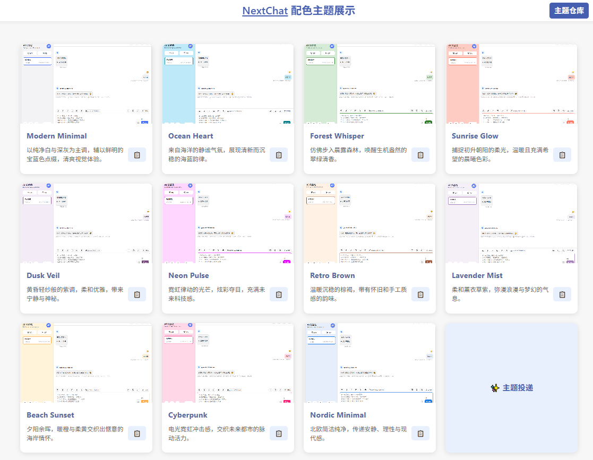

# 🎨 NextChat 颜色主题库

  
*多样配色主题，给你的 NextChat 带来全新视觉体验*

---

## 🚀 项目简介

**NextChat 颜色主题库** 是为 [NextChat 聊天框架](https://github.com/QAbot-zh/ChatGPT-Next-Web) 专门打造的主题配色集合。这里汇聚了多款由社区设计和贡献的精美主题，支持暗黑模式和亮色模式双配色方案。

每款主题都附带高清预览图，让你直观感受不同配色美感，并提供一键复制 CSS 代码，方便你快速应用到自己的 NextChat 项目中，轻松定制个性化界面。

---

## ✨ 主要特色

- **丰富多样的主题选择**  
  数十款精心设计的主题，覆盖多种风格与配色需求

- **光暗双模式支持**  
  同时适配亮色与暗黑模式，满足不同使用场景

- **一键复制主题代码**  
  快速复制符合 NextChat 主题结构的 CSS，极速搭建

- **响应式展示界面**  
  美观实用，桌面 & 移动端均体验流畅

- **社区共建，贡献你的配色**  
  欢迎提交主题 PR，让更多人用上你独特设计！

---

## 🖼️ 主题预览

在 [在线演示页面](https://nextchat-theme.pages.dev) 一键浏览所有主题，并点击图片查看大图。

---

## 🛠️ 如何使用

1. 打开主题库页面，浏览并找到你喜欢的主题。
2. 点击主题卡片右侧的📋按钮，复制出适合 light 和 dark 模式的 CSS 代码。
3. 将复制的代码添加到你的 NextChat 项目的自定义样式文件中。
4. 切换主题（`需要指定 light 或者 dark 才会注入，auto 主题需要设置 root 域变量`），畅享专属于你的界面配色。

---

## 💡 贡献指南

欢迎任何形式的主题设计与代码贡献！

1. Fork 本仓库
2. 在 `themes.js` 中添加你的主题配置，附上预览图片链接和描述
3. 提交 Pull Request，写明主题名称和特色介绍
4. 通过后你的主题将被收录到库中，大家都能使用！

---

## 📢 相关链接

- NextChat 项目主页：[https://github.com/QAbot-zh/ChatGPT-Next-Web](https://github.com/QAbot-zh/ChatGPT-Next-Web)
- 主题仓库主页（本项目）：[https://github.com/QAbot-zh/NextChat-Theme](https://github.com/QAbot-zh/NextChat-Theme)
- 在线主题预览页：[https://nextchat-theme.pages.dev/](https://nextchat-theme.pages.dev)

---

## ❤️ 致谢

感谢所有贡献主题设计和代码的社区朋友们！  
愿我们一起打造更美的 NextChat 使用体验！

---

*如果你喜欢这个项目，别忘了点个⭐ Star 支持哦！*
